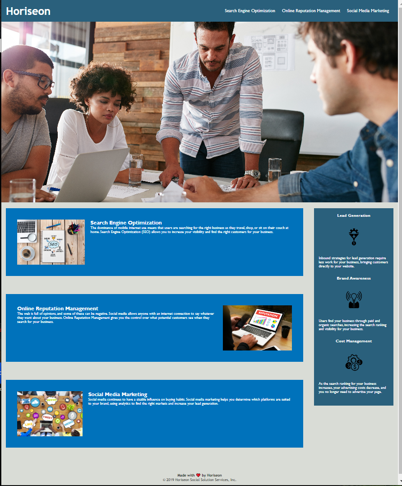

# Git-HW-One

## General Information
- In this project we added accessibility to images and texts to visually impared can also enjoy our website.
- We condensed code to make it easier to understand
- We also formatted the code to be in a logical order

## Screenshot

## Setup 
N/A

## Usage
 - It is for an assignment and teaches how to build a accessible website
 
## Room for improvment
- All around needs smoothing out

## Contact 
Created by TristanM225
